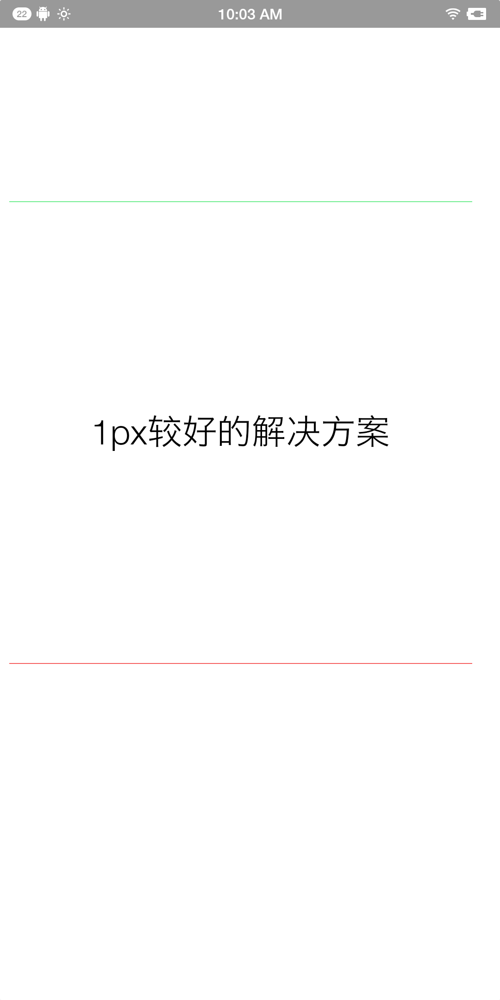

### 1px较好的解决方案

> 基本安卓ios要求都可以满足

```css
    .singleLine {
      position: relative;
    }

    .singleLine::after,
    .singleLine::before {
      content: "";
      position: absolute;
      left: 0;
      right: auto;
      height: 1px;
      width: 100%;
      display: block;
      z-index: 1;
      transform-origin: 50% 0;
    }

    .bd-bottom::after,
    .bd-bottom::before {
      color: currentColor;
    }

    .bd-bottom::after {
      top: auto;
      bottom: 0;
      background-color: #f00505;
    }

    .bd-top::before {
      background-color: #24e454;
      top: 0;
      bottom: auto;
    }
    
    @media only screen and (-webkit-min-device-pixel-ratio: 2) {

      .singleLine::after,
      .singleLine::before {
        transform: scaleY(0.5);
      }
    }

    @media only screen and (-webkit-min-device-pixel-ratio: 3) {

      .singleLine::after,
      .singleLine::before {
        transform: scaleY(0.33333);
      }
    }
```

```html
    <div class="singleLine  bd-bottom bd-top">111111111111111</div>
```
<div align=center>


